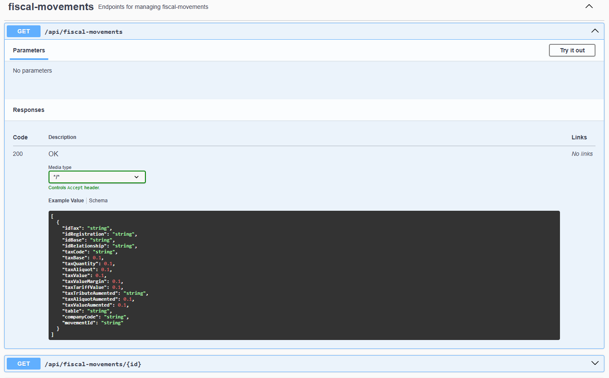

# Tax Assistant


## Project Summary

Spring REST project for a Tax Assistant tool designed to help the retail sector deal with the complexity of Brazilian
tax regulations. It offers simplified explanations and leverages artificial intelligence to suggest appropriate tax
profiles for customers and products, detect fiscal anomalies, identify unexpected tax differences, and flag incorrect
parameter configurations.

## Tech Stack Used

### Core

- `Java` v21
- `Spring Boot` v3.5.5

### Database

- `SQL Server` v2019 or higher
- `MongoDB` (via Spring Data MongoDB)
- `spring-jdbc` v6.2.7

### Spring Starters

- `spring-boot-starter-actuator`
- `spring-boot-starter-data-jpa`
- `spring-boot-starter-data-mongodb`
- `spring-boot-starter-security`
- `spring-boot-starter-oauth2-client`
- `spring-boot-starter-validation`
- `spring-boot-starter-web-services`
- `spring-boot-devtools` (runtime, optional)
- `springdoc-openapi-starter-webmvc-ui` v2.8.11

### Utilities

- `mssql-jdbc` (runtime)
- `lombok` (provided)
- `org.jetbrains:annotations` v24.0.0

### Testing

- `spring-boot-starter-test` v3.5.5
- `spring-security-test`
- `mockito-core` v5.17.0
- `junit-jupiter-api` v5.12.2
- `mockito-junit-jupiter` v5.17.0

### Spring Framework Core

- `spring-web` v6.2.7
- `spring-boot-autoconfigure` v3.5.5
- `spring-context` v6.2.7

## Installation

git clone https://github.com/santospage/tax-assistant-spring.git

```
├── .github
│   └── workflows
│       └── unit-tests.yaml
├── src
│   ├── main
│   │   └── java
│   │       └── br
│   │           └── com
│   │               └── santospage
│   │                   └── taxassistant
│   │                       ├── application
│   │                       │   └── services
│   │                       │       ├── CustomerService.java
│   │                       │       ├── FiscalMovementsService.java
│   │                       │       ├── SalesMovementsService.java
│   │                       │       ├── ProductService.java
│   │                       │       └── mongo
│   │                       │           ├── CustomUserDetailsService.java
│   │                       │           └── UserService.java
│   │                       ├── domain
│   │                       │   ├── enums
│   │                       │       ├── UserRole.java
│   │                       │   │   └── CustomerType.java
│   │                       │   ├── exceptions
│   │                       │   │   ├── CustomerNotFoundException.java
│   │                       │   │   ├── FiscalMovementNotFoundException.java
│   │                       │   │   ├── SalesMovementNotFoundException.java
│   │                       │   │   ├── ProductNotFoundException.java
│   │                       │   │   ├── UserAlreadyExistsException.java
│   │                       │   │   └── UserNotFoundException.java
│   │                       │   ├── models
│   │                       │   │   ├── Customer.java
│   │                       │   │   ├── FiscalMovement.java
│   │                       │   │   ├── SalesMovement.java
│   │                       │   │   ├── Product.java
│   │                       │   │   └── mongo
│   │                       │   │       └── User.java
│   │                       │   └── repositories
│   │                       │       ├── CustomerRepository.java
│   │                       │       ├── FiscalMovementRepository.java
│   │                       │       ├── SalesMovementRepository.java
│   │                       │       ├── ProductRepository.java
│   │                       │       └── mongo
│   │                       │           └── UserRepository.java
│   │                       ├── infrastructure
│   │                       │   ├── external
│   │                       │   ├── ia
│   │                       │   └── security
│   │                       │       ├── JwtAuthenticationFilter.java
│   │                       │       ├── JwtTokenProvider.java
│   │                       │       └── SecurityConfig.java
│   │                       ├── interfaces
│   │                       │   └── controllers
│   │                       │       ├── AuthController.java
│   │                       │       ├── CustomerController.java
│   │                       │       ├── FiscalMovementController.java
│   │                       │       ├── SalesMovementController.java
│   │                       │       ├── ProductController.java
│   │                       │       └── mongo
│   │                       │           └── UserController.java
│   │                       └── TaxAssistantApplication.java
├── test
│   └── java
│       └── br
│           └── com
│               └── santospage
│                   └── taxassistant
│                       ├── application
│                       │   └── services
│                       │       ├── mongo
│                       │       │   └── UserServiceTest.java
│                       │       ├── CustomerServiceTest.java
│                       │       ├── FiscalMovementsServiceTest.java
│                       │       ├── SalesMovementsServiceTest.java
│                       │       └── ProductServiceTest.java
│                       ├── infrastructure
│                       │   ├── external
│                       │   ├── ia
│                       │   └── security
│                       │       └── JwtTokenProviderTest.java
│                       └── interfaces
│                          └── controllers
│                               ├── mongo
│                               │   └── UserControllerTest.java
│                               ├── AuthControllerTest.java
│                               ├── CustomerControllerTest.java
│                               ├── FiscalMovementControllerTest.java
│                               ├── SalesMovementControllerTest.java
│                               └── ProductControllerTest.java
├── assets
│   ├── auth.png
│   ├── home.png
│   ├── home1.png
│   ├── customers.png
│   ├── movemets.png
│   ├── movemets1.png
│   ├── movemets2.png
│   ├── sales.png
│   ├── sales1.png
│   ├── sales2.png
│   ├── sales3.png
│   ├── user.png
│   ├── user1.png
│   ├── user2.png
│   ├── user3.png
│   ├── user4.png
│   └── products.png
├── .gitignore
├── .gitattributes
├── pom.xml
└── README.md

```

### Project Installation

Follow the steps below to set up the project on your local machine.

## How to Run the API

### Endpoints

The API exposes the following endpoints under the base URL https://localhost:8443/api:

### API Documentation (Swagger)


`/customers`

- `GET /api/customers`
- `GET /api/customers?company={company}&id={id}`

**Query Parameters:**

| Parameter | Type   | Description  | Required |
|-----------|--------|--------------|----------|
| company   | string | Company code | Yes      |
| id        | string | Customer ID  | Yes      |

**Responses:**

200 OK:
Customer found. Returns the customer object.

404 Not Found:
Customer not found. Returned when no customer exists for the given `company` and `id`.

### API Documentation (Swagger)


`/fiscal-movements`

- `GET /api/fiscal-movements`
- `GET /api/fiscal-movements?company={company}&id={id}`

Retrieve a fiscal movement by its ID.

**Path Parameters:**

| Parameter | Type   | Description        | Required |
|-----------|--------|--------------------|----------|
| id        | string | Fiscal movement ID | Yes      |

**Responses:**

200 OK:
Fiscal movement found. Returns the object.

404 Not Found:
Fiscal movement not found. Returned when no fiscal movement exists for the given `id`.

- `GET /api/fiscal-movements/table/{table}`

Retrieve all fiscal movements for a specific table.

**Path Parameters:**

| Parameter | Type   | Description     | Required |
|-----------|--------|-----------------|----------|
| table     | string | Table code/name | Yes      |

**Responses:**

200 OK:
Fiscal movement found. Returns the object.

404 Not Found:
Fiscal movement not found. Returned when no fiscal movements exists for the given `table`.

### API Documentation (Swagger)




`/products`

- `GET /api/products`
- `GET /api/products?company={company}&id={id}`

**Query Parameters:**

| Parameter | Type   | Description  | Required |
|-----------|--------|--------------|----------|
| company   | string | Company code | Yes      |
| id        | string | Product ID   | Yes      |

**Responses:**

200 OK:
Product found. Returns the product object.

404 Not Found:
Product not found. Returned when no product exists for the given `company` and `id`.

### API Documentation (Swagger)


`/sales-movements`

- `GET /api/sales-movements`

Returns all sales movements.

Responses:

* 200 OK: Returns a list of movements.
* 404 Not Found: No movements found.

---

- `GET /api/sales-movements/{id}`

Returns a specific sales movement by ID.

Path Parameters:

| Parameter | Type   | Description | Required |
|-----------|--------|-------------|----------|
| id        | string | Movement ID | Yes      |

Responses:

* 200 OK: Returns the movement object.
* 404 Not Found: Movement not found.

---

- `GET /api/sales-movements/product/{productCode}`

Returns all sales movements for a specific product.

Path Parameters:

| Parameter   | Type   | Description  | Required |
|-------------|--------|--------------|----------|
| productCode | string | Product code | Yes      |

Responses:

* 200 OK: Returns a list of movements for the product.
* 404 Not Found: No movements found for the product.

---

- `GET /api/sales-movements/customer/{customerCode}`

Returns all sales movements for a specific customer.

Path Parameters:

| Parameter    | Type   | Description   | Required |
|--------------|--------|---------------|----------|
| customerCode | string | Customer code | Yes      |

Responses:

* 200 OK: Returns a list of movements for the customer.
* 404 Not Found: No movements found for the customer.

---

### Example Images (Swagger UI)


`/users`

- `GET /api/users`

Returns all users.

Responses:

* 200 OK: Returns a list of movements.
* 404 Not Found: No movements found.

---

- `GET /api/users/{username}`

Returns a specific user by username.

Path Parameters:

| Parameter | Type   | Description | Required |
|-----------|--------|-------------|----------|
| username  | string | Username    | Yes      |

Responses:

* 200 OK: Returns the movement object.
* 404 Not Found: Movement not found.

---

- `POST /api/users/{username}`

Creates a new user with the given username.

Path Parameters:

| Parameter | Type   | Description | Required |
|-----------|--------|-------------|----------|
| username  | string | Username    | Yes      |

Responses:

* 201 Created: User successfully created.
* 400 Bad Request: Invalid data or user already exists.

---

- `Put /api/users/{username}`

Updates an existing user by username.

Path Parameters:

| Parameter | Type   | Description | Required |
|-----------|--------|-------------|----------|
| username  | string | Username    | Yes      |

Responses:

* 200 OK: User successfully updated.
* 404 Not Found: User not found.
* 400 Bad Request: Invalid update data.

---

- `DELETE /api/users/{username}`

Deletes a user by username.

Path Parameters:

| Parameter | Type   | Description | Required |
|-----------|--------|-------------|----------|
| username  | string | Username    | Yes      |

Responses:

* 200 OK: User successfully deleted.
* 404 Not Found: User not found.

---

### Example Images (Swagger UI)


`/login`

- `POST /api/auth/login`

Authenticate a user and obtain a JWT token.

Path Parameters:

| Parameter | Type   | Description   | Required |
|-----------|--------|---------------|----------|
| username  | string | Username      | Yes      |
| password  | string | User password | Yes      |

Responses:

* 200 OK: Authentication successful, returns JWT token.
* 401 Unauthorized: Invalid username or password.

---

### Example Images (Swagger UI)


---

### DataBase

- **SQL Server**: Used for fiscal movements, products, and transactional data.
- **MongoDB**: Used for user management and authentication (login, roles, sessions).
