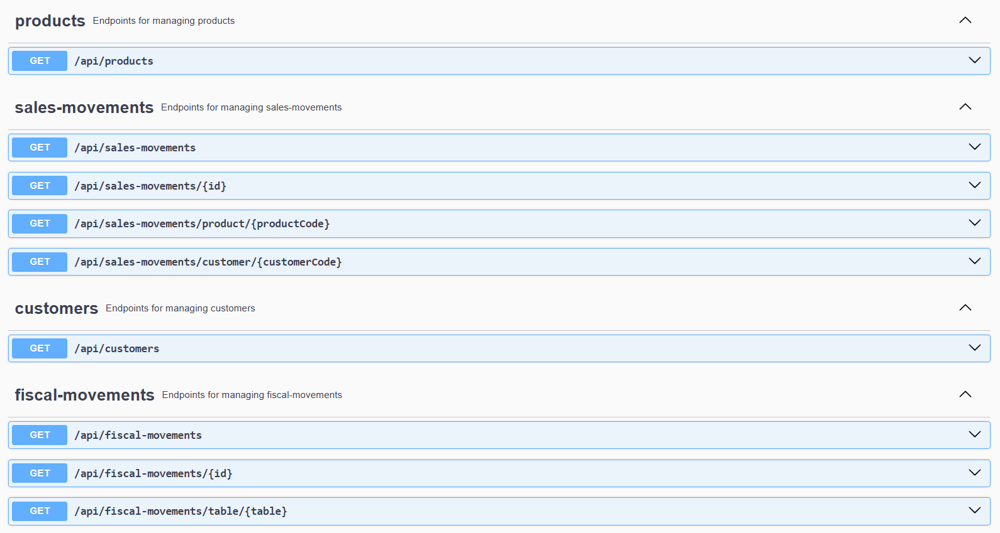
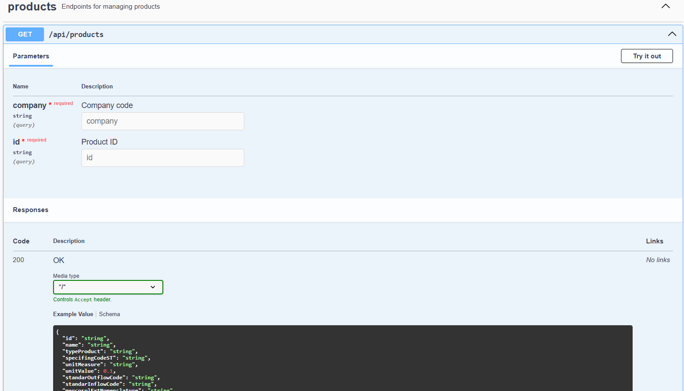

# Tax Assistant


## Project Summary

Spring REST project for a Tax Assistant tool designed to help the retail sector deal with the complexity of Brazilian
tax regulations. It offers simplified explanations and leverages artificial intelligence to suggest appropriate tax
profiles for customers and products, detect fiscal anomalies, identify unexpected tax differences, and flag incorrect
parameter configurations.

## Tech Stack Used

- `Java` v23.0.2
- `Spring Boot` v3.5.0
- `SQL Server` v2019 ou superior

- `spring-boot-starter-actuator`
- `spring-boot-starter-data-jpa`
- `spring-boot-starter-data-mongodb`
- `spring-boot-starter-security`
- `spring-boot-starter-oauth2-client`
- `spring-boot-starter-validation`
- `spring-boot-starter-web-services`
- `mssql-jdbc`
- `lombok`

- `spring-test` v6.2.7
- `mockito-core` v5.17.0
- `junit-jupiter-api` v5.12.2
- `mockito-junit-jupiter` v5.17.0
- `spring-jdbc` v6.2.7
- `spring-boot-test` v3.5.0
- `spring-web` v6.2.7
- `spring-boot-autoconfigure` v3.5.0
- `spring-context` v6.2.7

## Installation

git clone https://github.com/santospage/tax-assistant-spring.git

```
├── src
│   ├── main
│   │   └── java
│   │       └── br
│   │           └── com
│   │               └── santospage
│   │                   └── taxassistant
│   │                       ├── application
│   │                       │   ├── services
│   │                       │   │   ├── CustomerService.java
│   │                       │   │   ├── FiscalMovementsService.java
│   │                       │   │   └── ProductService.java
│   │                       │   └── usecases
│   │                       ├── domain
│   │                       │   ├── entities
│   │                       │   │   ├── Customer.java
│   │                       │   │   ├── FiscalMovement.java
│   │                       │   │   └── Product.java
│   │                       │   ├── enums
│   │                       │   ├── exceptions
│   │                       │   └── repositories
│   │                       │       ├── CustomerRepository.java
│   │                       │       ├── FiscalMovementRepository.java
│   │                       │       └── ProductRepository.java
│   │                       ├── infrastructure
│   │                       │   ├── database
│   │                       │   │   ├── CustomerRepositoryImpl.java
│   │                       │   │   ├── CustomerRowMapper.java
│   │                       │   │   ├── FiscalMovementRepositoryImpl.java
│   │                       │   │   ├── FiscalMovementRowMapper.java
│   │                       │   │   ├── ProductRepositoryImpl.java
│   │                       │   │   └── ProductRowMapper.java
│   │                       │   ├── external
│   │                       │   └── ia
│   │                       ├── interfaces
│   │                       │   ├── controllers
│   │                       │   │   ├── CustomerController.java
│   │                       │   │   ├── FiscalMovementController.java
│   │                       │   │   └── ProductController.java
│   │                       │   └── dtos
│   │                       │       ├── CustomerDTO.java
│   │                       │       ├── FiscalMovementDTO.java
│   │                       │       └── ProductDTO.java
│   │                       └── TaxAssistantApplication.java
├── test
│   └── java
│       └── br
│           └── com
│               └── santospage
│                   └── taxassistant
│                       ├── application
│                       │   ├── services
│                       │   │   ├── CustomerServiceTest.java
│                       │   │   ├── FiscalMovementsServiceTest.java
│                       │   │   └── ProductServiceTest.java
│                       │   └── usecases
│                       ├── domain
│                       │   ├── entities
│                       │   ├── enums
│                       │   ├── exceptions
│                       │   └── repositories
│                       ├── infrastructure
│                       │   ├── database
│                       │   │   ├── CustomerRepositoryImplTest.java
│                       │   │   ├── CustomerRowMapperTest.java
│                       │   │   ├── FiscalMovementRepositoryImplTest.java
│                       │   │   ├── FiscalMovementRowMapperTest.java
│                       │   │   ├── ProductRepositoryImplTest.java
│                       │   │   └── ProductRowMapperTest.java
│                       │   ├── external
│                       │   └── ia
│                       ├── interfaces
│                       │   ├── controllers
│                       │   │   ├── CustomerControllerTest.java
│                       │   │   ├── FiscalMovementControllerTest.java
│                       │   │   └── ProductControllerTest.java
│                       │   └── dtos
│                       └── TaxAssistantApplicationTest.java
├── assets
│   ├── home.png
│   ├── customers.png
│   ├── movemets.png
│   └── products.png
├── .gitignore
├── .gitattributes
├── pom.xml
├── README.md
└── README.md

```

### Project Installation

Follow the steps below to set up the project on your local machine.

## How to Run the API

### Endpoints

The API exposes the following endpoints under the base URL http://localhost:8080/api:

### API Documentation (Swagger)



`/customers`

- `GET /api/customers`
- `GET /api/customers/{id}`

### API Documentation (Swagger)


`/fiscal-movements`

- `GET /api/fiscal-movements`
- `GET /api/fiscal-movements/{id}`
- `GET /api/fiscal-movements/table/{table}`

### API Documentation (Swagger)


`/products`

- `GET /api/products`
- `GET /api/products/{id}`

### API Documentation (Swagger)



### DataBase

This project uses SQL Server and MongoDB as database management systems.

## Roadmap

- Authentication
- Error handling
- Validations
